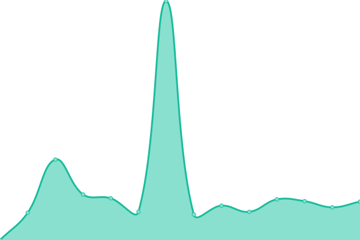

# [📈 Live Status](https://htmambo.github.io/upptime): <!--live status--> **所有系统工作正常**

This repository contains the open-source uptime monitor and status page for [果农](https://htmambo.github.io/upptime), powered by [Upptime](https://github.com/upptime/upptime).

With [Upptime](https://upptime.js.org), you can get your own unlimited and free uptime monitor and status page, powered entirely by a GitHub repository. We use [Issues](https://github.com/htmambo/upptime/issues) as incident reports, [Actions](https://github.com/htmambo/upptime/actions) as uptime monitors, and [Pages](https://htmambo.github.io/upptime) for the status page.

<!--start: status pages-->
<!-- This summary is generated by Upptime (https://github.com/upptime/upptime) -->
<!-- Do not edit this manually, your changes will be overwritten -->
<!-- prettier-ignore -->
| URL | Status | History | Response Time | Uptime |
| --- | ------ | ------- | ------------- | ------ |
|  [blog](https://blog.imzhp.com) | 正常 | [blog.yml](https://github.com/htmambo/upptime/commits/HEAD/history/blog.yml) | 

 1383ms
     
 | 

<a href="https://status.arpl.eu.org/history/blog">99.10%</a>
    

|  [reader](https://reader.hoping.eu.org) | 正常 | [reader.yml](https://github.com/htmambo/upptime/commits/HEAD/history/reader.yml) | 

 1155ms
     
 | 

<a href="https://status.arpl.eu.org/history/reader">95.82%</a>
    

|  [host_us](https://izhp.eu.org/) | 正常 | [host-us.yml](https://github.com/htmambo/upptime/commits/HEAD/history/host-us.yml) | 

 953ms
     
 | 

<a href="https://status.arpl.eu.org/history/host-us">100.00%</a>
    

|  [host_hk](38.207.164.24) | 正常 | [host-hk.yml](https://github.com/htmambo/upptime/commits/HEAD/history/host-hk.yml) | 

 191ms
     
 | 

<a href="https://status.arpl.eu.org/history/host-hk">100.00%</a>
    

|  [office](58.213.197.202) | 正常 | [office.yml](https://github.com/htmambo/upptime/commits/HEAD/history/office.yml) | 

 205ms
     
 | 

<a href="https://status.arpl.eu.org/history/office">100.00%</a>
    

<!--end: status pages-->

[**Visit our status website →**](https://htmambo.github.io/upptime)

## 📄 License

- Powered by: [Upptime](https://github.com/upptime/upptime)
- Code: [MIT](./LICENSE) © [Anand Chowdhary](https://anandchowdhary.com), supported by [Pabio](https://pabio.com)
- Data in the `./history` directory: [Open Database License](https://opendatacommons.org/licenses/odbl/1-0/)
